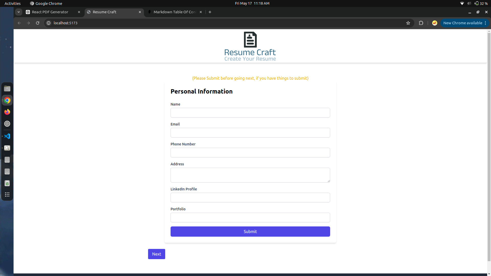
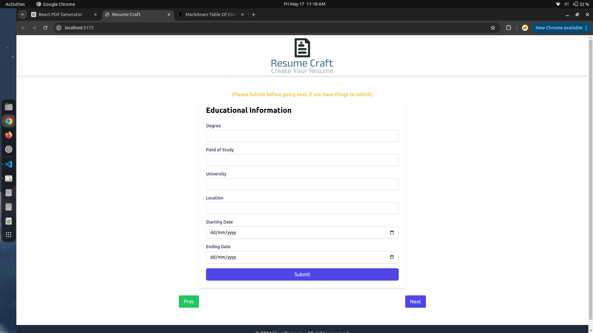
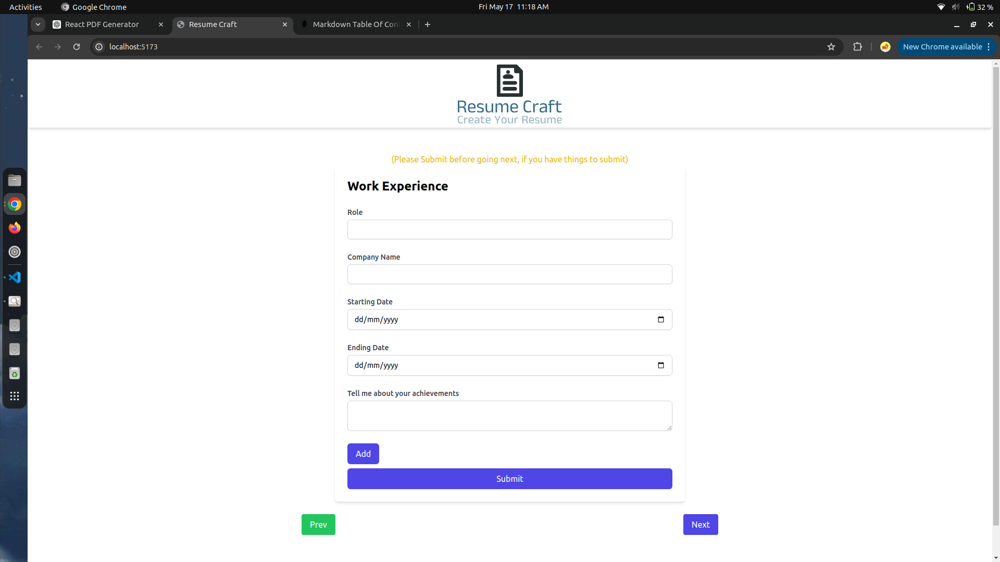
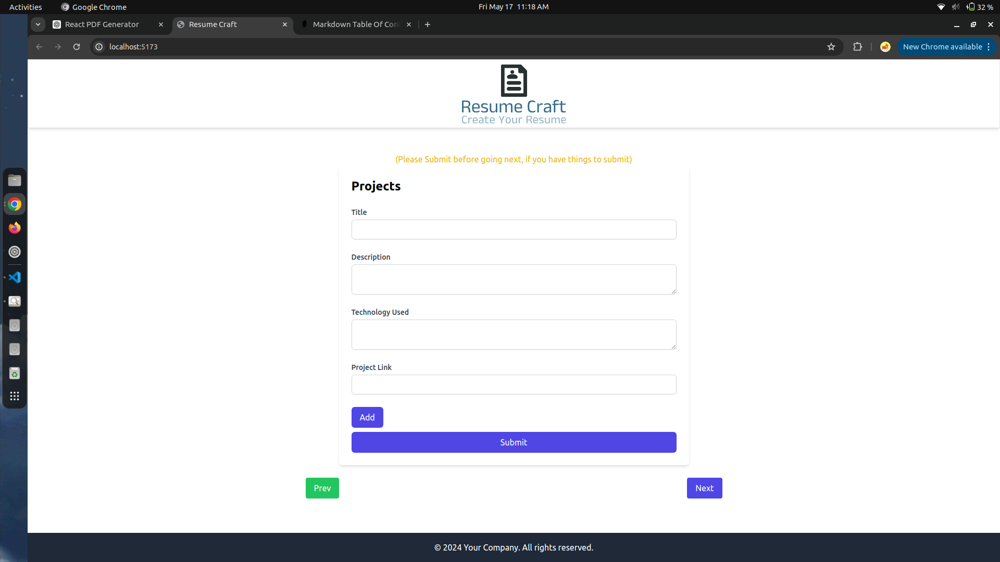
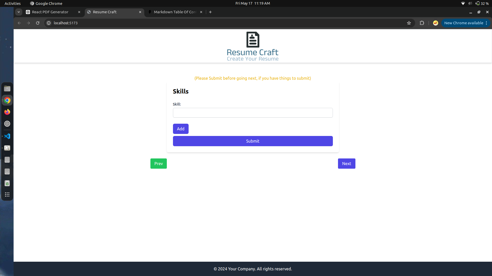
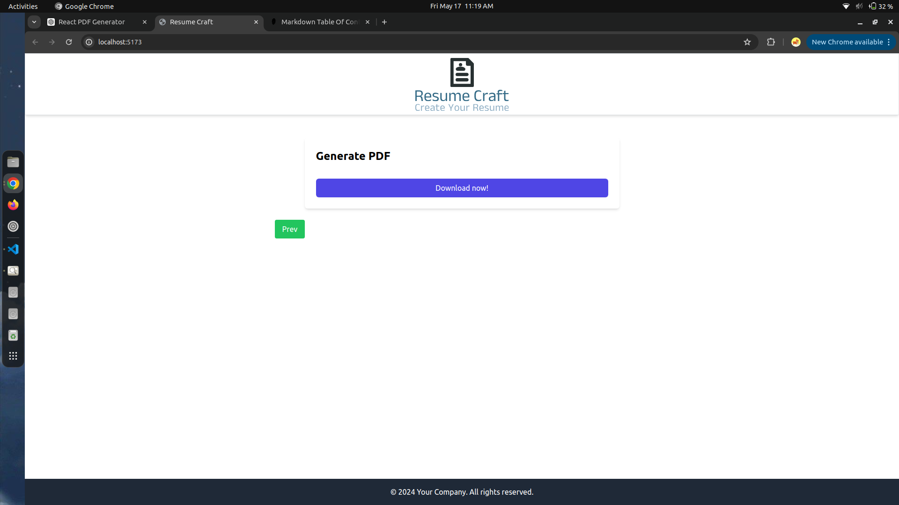

# Resume Craft

Resume Craft is a React-based web application that helps users create and download professional resumes. Built using React JS, Tailwind CSS, Redux Toolkit, and React-PDF, Resume Craft allows users to input their personal information, educational background, work experiences, projects, and skills, and then generates a downloadable PDF resume.

**Table of Contents**

- [Resume Craft](#resume-craft)
  - [Features](#features)
  - [Installation](#installation)
  - [Usage](#usage)
  - [Components](#components)
  - [Technologies Used](#technologies-used)
  - [Demo](#demo)
  - [Preview](#preview)

## Features

- **User-friendly forms**: Input personal, educational, work, project, and skill information.
- **Download**: Generate and download a PDF version of the resume.
- **Responsive design**: Works on both desktop and mobile devices.
- **State management**: Uses Redux Toolkit for efficient state management.

## Installation

1. **Clone the repository:**

```bash
git clone https://github.com/debrajroyofficial000/Resume-Craft.git
cd Resume-craft
```

2. **Install dependencies:**

```bash
npm install
```

3. **Run the application:**

```bash
npm run dev
```

## Usage

1. Start the application by running npm start and opening http://localhost:5173 in your browser.
2. Fill out the forms for personal information, education, work experience, projects, and skills.
3. Navigate between forms using the "Next" and "Prev" buttons.
4. Submit the information to generate a PDF resume.
5. Download the PDF resume by clicking the "Download" button.

## Components

1. Header: Contains the title and navigation links.
2. Footer: Displays footer content.
3. PersonalForm: Form to input personal information.
4. EducationalForm: Form to input educational background.
5. WorkForm: Form to input work experiences.
6. ProjectForm: Form to input project details.
7. SkillForm: Form to input skills.
8. PDFGenerator: Generates the PDF resume.
9. ResumePDF : Create Resume Pdf

## Technologies Used

1. React JS: Frontend library for building user interfaces.
2. Tailwind CSS: Utility-first CSS framework for styling.
3. Redux Toolkit: State management library.
4. React-PDF: Library to create PDF documents in React.

## Demo








## Preview

[Preview](https://6646f1ab5b0c796edc3268ee--simpleresumecraft.netlify.app/)
